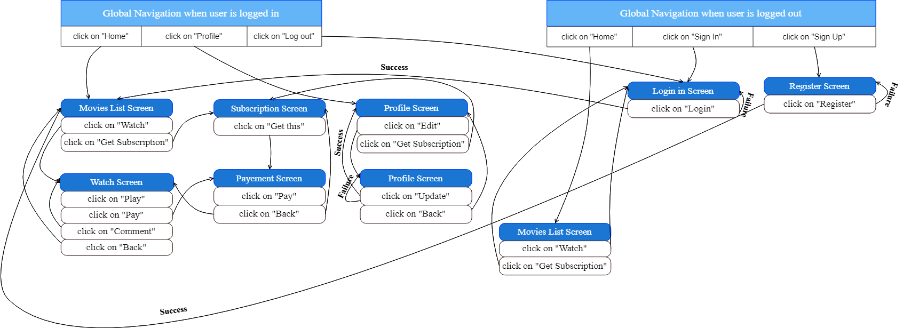

# README

## Development Language
* Ruby : 2.6.5
* Rails : 5.2.6

This application based on this technologies

## Employmemnt Term Technology

* Devise
* Commment system
* Favorites System

## Technologies outside the curriculum

* Cloudinary
* Fedapay Api
* Video Upload

## Execution procedure 

```
$ git clone https://github.com/Parmenas1002/Original-App-DiveIntoCode.git
$ cd Original-App-DiveIntoCode
$ bundle install
$ rails db:create
$ rails db:migrate
$ rails db:seed
$ rails s

```

## Catalogue Design 

https://docs.google.com/spreadsheets/d/1WeOo4967KHoOQ9-uvPQkCfQRRyh6p6mvHb1hHRekr9o/edit?usp=sharing

## Table Definition Document

https://docs.google.com/spreadsheets/d/1C_TpkyEKpyLq90wzl77QkVVNPL-tfuxRjJHofWVpfeo/edit?usp=sharing

## Check Sheet 

https://docs.google.com/spreadsheets/d/1LTUUULX_LPOt3UqAhZG5Bv6c0iz2MjcFmFeE52B5Bk4/edit?usp=sharing

## ER Diagram


https://cacoo.com/diagrams/uCPt9MfzFasvSgb2/CFCC6

## Screen Transition Diagram



https://cacoo.com/diagrams/PpZPXCkj54ml3xUU/F9C07

## Wireframes

https://cacoo.com/diagrams/og7rfkQ7lF8QMxl9/0075C